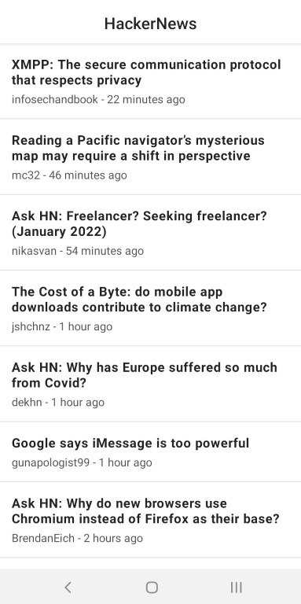
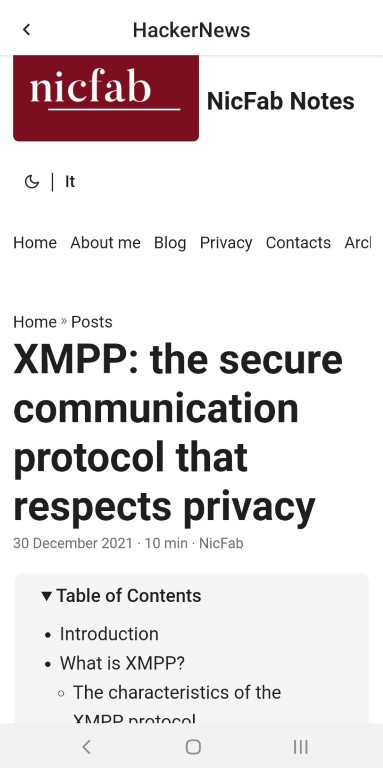

HackerNews
============

A simple hacker news app using for experimental features.

## Screenshots
Splash Screen | Stories Screen | Story Detail Screen
:-:|:-:|:-:
 |  | 

License
=======

    Copyright (c) 2022 jesusd0897.
    
    Licensed under the Apache License, Version 2.0 (the "License");
    you may not use this file except in compliance with the License.
    You may obtain a copy of the License at
    
        http://www.apache.org/licenses/LICENSE-2.0
    
    Unless required by applicable law or agreed to in writing, software
    distributed under the License is distributed on an "AS IS" BASIS,
    WITHOUT WARRANTIES OR CONDITIONS OF ANY KIND, either express or implied.
    See the License for the specific language governing permissions and
    limitations under the License.
